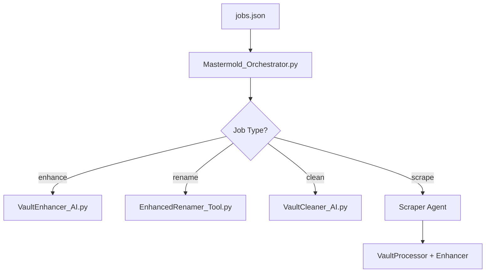

# 🤖 Mastermold Orchestrator

This document explains the purpose, structure, and usage of the `Mastermold_Orchestrator.py` script — your centralized job queue processor and multi-agent runner.

---

## 📌 Purpose

`Mastermold_Orchestrator.py` is the **AI job dispatcher**. It reads a `jobs.json` file and routes each task to the appropriate tool (like VaultProcessor, Enhancer, Scrapers, etc.).

It’s designed to:
- Automate batch operations
- Chain complex multi-step jobs
- Run hands-free once a `jobs.json` queue is prepared

---

## 🧠 Job File Format: `jobs.json`

This file contains a list of job dictionaries:
```json
[
  {
    "type": "enhance",
    "source": "Vault/Raw/filename.txt"
  },
  {
    "type": "rename",
    "source": "Vault/YouTube/AI/Chatbots/video.md"
  }
]
```

Each job must include:
- `type`: enhance, rename, clean, scrape, etc.
- `source`: path to the file or URL

Optional fields:
- `output_path`
- `tags`, `source_type`, etc.

---

## 🔄 Supported Job Types

| Type     | Action Taken |
|----------|--------------|
| `enhance` | Runs VaultEnhancer on target `.md` |
| `rename`  | Runs EnhancedRenamer on an enhanced `.md` |
| `clean`   | (Optional) Launches VaultCleaner for duplicates |
| `scrape_reddit` | Calls RedditScraper_Agent |
| `scrape_youtube` | Calls YouTubeScraper_Agent |
| `scrape_article` | Calls ArticleScraper_Agent |

---

## 🔁 Execution Flow



---

## 🛠 Logs

Each run writes a job-specific log file to:
```
/Logs/job_YYYY-MM-DD_HH-MM-SS.json
```

You can summarize logs using `summarize_job_logs.py`.

---

## 🚀 How to Use

```bash
python agents/Mastermold_Orchestrator.py
```

Make sure:
- `jobs.json` is in root or same folder
- Source paths are correct
- Vault paths exist and are writable

---

👑 Mastermold is your GPT-powered automation general. It reads. It decides. It delegates.
