# 🧠 Vault Processor + Enhancer System

This document explains the purpose and flow of the two core scripts that power your vault intelligence system:

---

## 1. `VaultProcessor_AI.py` — 🧹 Raw Input Organizer

### 📌 Purpose:
Processes `.txt` and `.md` files placed into `Vault/Raw/`, cleans them, categorizes them, saves in multiple formats, and updates the vault index database.

### 🔄 Workflow:
1. Scans `Vault/Raw/` for new files
2. Cleans and strips formatting
3. Tries to extract:
   - **source** (e.g., "YouTube", "Reddit")
   - **category** (from tags or metadata)
   - **subtopic** (filename-based fallback)
4. Saves 3 versions of the file:
   - `.md` → for GPT
   - `.json` → for metadata
   - `.txt` → for fast scanning
5. Files are saved to:
   ```
   Vault/<Source>/<Category>/<Subtopic>/<filename>.md
   ```
6. Adds an entry to:
   ```
   Vault/Index/vault_index.db
   ```
7. Automatically runs: `VaultEnhancer_AI.py` on the new `.md`

---

## 2. `VaultEnhancer_AI.py` — 🤖 GPT Section Extractor

### 📌 Purpose:
Uses GPT to break down `.md` files into deep, structured knowledge using 11 categories.

### 🧠 Extracted Sections:
- Key Ideas
- Philosophy
- Psychology
- Strategy
- Methodology
- Process
- How-To Guide
- Impactful Quotes
- Mental Models
- Pitfalls (Don'ts)
- Target Audience

### 🔄 Workflow:
1. Loads `.md` files from `Vault/` that are **not yet enhanced**
2. Breaks each file into 6000-token chunks
3. Sends each to GPT-3.5 with a structured system + user prompt
4. Combines all extracted data into one `.md` file:
   ```
   originalfilename_enhanced.md
   ```

---

## 🔁 Combined Automation Flow:

```mermaid
flowchart TD
    A[Raw .txt/.md File → Vault/Raw/] --> B[Run VaultProcessor_AI.py]
    B --> C[Organized into Vault/<Source>/<Category>/<Subtopic>/]
    C --> D[Saved as .md/.txt/.json]
    D --> E[Indexed in vault_index.db]
    E --> F[Trigger VaultEnhancer_AI.py]
    F --> G[Enhanced to _enhanced.md]
```



---

✅ Your vault is now automatically processed, structured, enhanced, and ready to be queried by GPT agents or searched via tools like VaultGPT.

