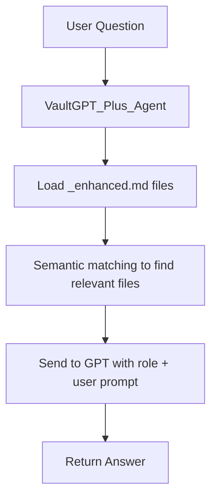

# 🧠 VaultGPT_Plus_Agent

`VaultGPT_Plus_Agent.py` is your intelligent command-line assistant for querying the contents of your enhanced vault. It uses OpenAI’s GPT to answer questions directly from your enhanced `.md` files.

---

## 📌 Purpose

This agent acts like a **vault-specific search engine with reasoning**. It:
- Reads all `_enhanced.md` files in your vault
- Uses GPT to answer your queries using only vault content
- Optionally filters by filename, topic, or tags

---

## 🔎 Features

✅ Semantic Search  
✅ File Relevance Matching  
✅ Markdown-Formatted GPT Answers  
✅ Handles Long Context  
✅ Optionally Filters by:

- Filename
- Directory (YouTube, Reddit, Articles, etc.)
- GPT role or system prompt

---

## 🧠 How It Works



---

## ⚙️ How to Use

```bash
python agents/VaultGPT_Plus_Agent.py
```

You’ll be prompted:
- 🧠 GPT Role (optional)
- 🔍 Query Prompt

Then it:
1. Loads all `_enhanced.md` files in `Vault/`
2. Uses GPT to interpret your query
3. Ranks and selects relevant files
4. Sends those chunks to GPT
5. Returns a full, formatted answer

---

## 📂 Requirements

- Enhanced `.md` files in `/Vault/.../_enhanced.md`
- OpenAI API key set in environment or script
- `tiktoken`, `openai`, `termcolor`, `markdownify`

---

## 🛠 Customization

You can:
- Change the default role in the script (e.g. historian, strategist)
- Adjust how many files are selected (default: top 4)
- Modify the Markdown formatting or citation style

---

## 🔒 Tip

For private deployments, you can save API key in a `.env` file and load it securely instead of hardcoding it.

---

This tool is your direct line to distilled knowledge.  
Ask. Instruct. Strategize. React.  
VaultGPT answers with intelligence grounded in your curated content.
